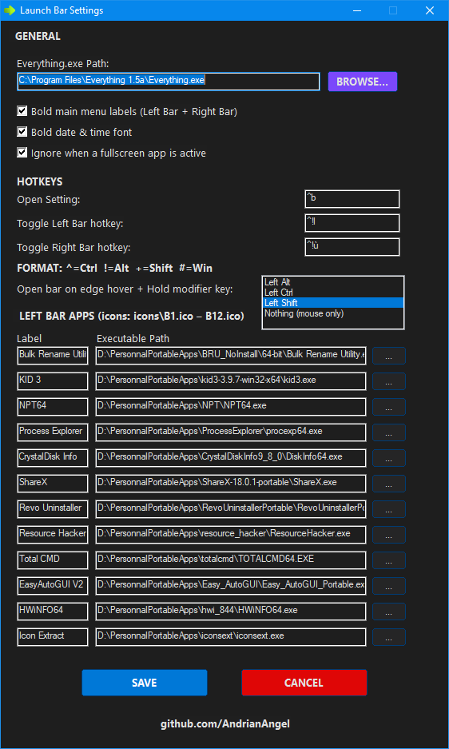
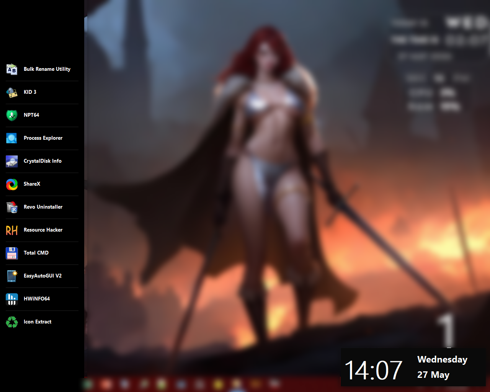
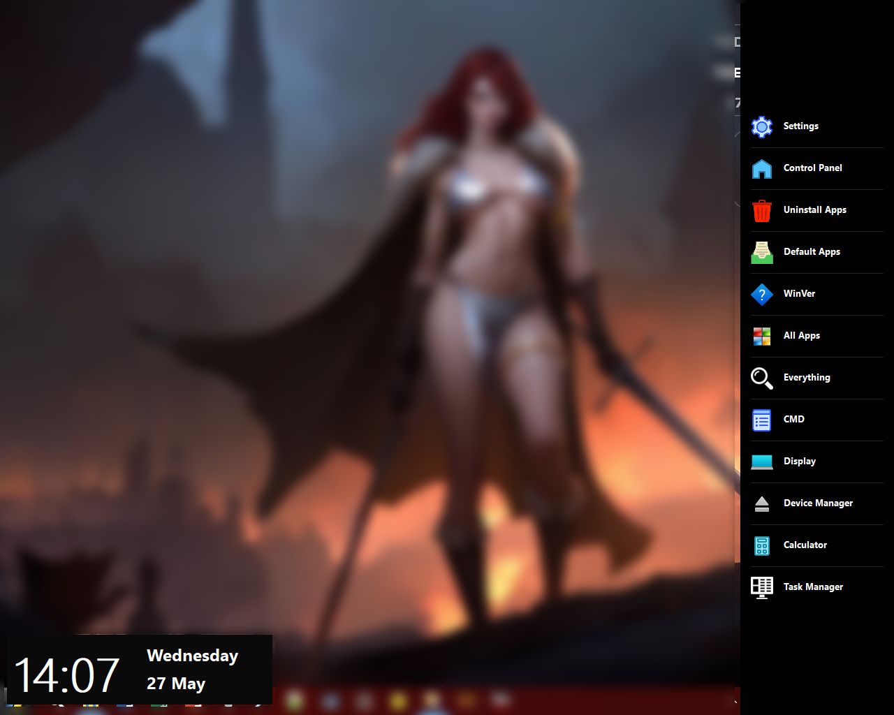
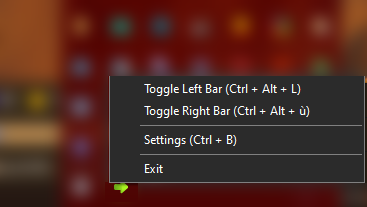
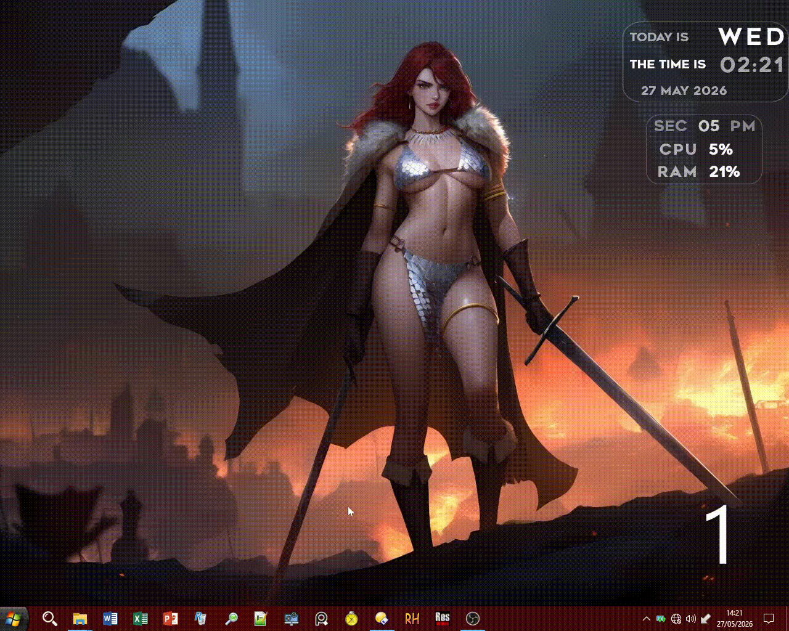

# 🌞 WIN8 SIDE BAR REBIRTH 2.0

**A Windows 8.1-inspired dual sidebar launcher for Windows 10/11**  
Slide-in sidebars, live clock, system shortcuts, and a fully customizable app launcher — all in a sleek dark UI.

---

---

### 🌞 WIN8 SIDE BAR REBIRTH 2.0

---

## ⚔️ SETTING GUI

---

## 🚩 LEFT SIDE BAR

---

## ✳️ RIGHT SIDE BAR

---

### 🔰 TRAY MENU

---

### 📽️ WATCH DEMO

---

## 📦 Downloads

| File | Architecture |
|------|-------------|
| `Win8_Side_Bar_Rebirth_2.0_Stable_Release_26_05_27_X64.exe` | 64-bit installer |
| `Win8_Side_Bar_Rebirth_2.0_Stable_Release_26_05_27_X86.exe` | 32-bit installer |
| `Win8_Side_Bar_Rebirth_2.0_Stable_Release_26_05_27_X64.zip` | 64-bit portable |
| `Win8_Side_Bar_Rebirth_2.0_Stable_Release_26_05_27_X86.zip` | 32-bit portable |
| `icons.zip` | Custom icon pack (A1–A12) |

---

## ✨ Features

- 🖥️ **Dual sidebar system** — independent Left Bar and Right Bar that slide in from screen edges
- 🕐 **Live clock flyout** — displays real-time hours, day name, and full date in large Segoe UI typography
- ⚙️ **System shortcuts bar (Right)** — one-click access to 12 built-in Windows tools
- 🚀 **Custom app launcher (Left)** — 12 fully configurable slots with custom labels and executable paths
- 🎨 **Custom icon support** — drop your own `.ico` files to personalize every button
- 🔒 **Fullscreen guard** — optionally suppresses both bars when a fullscreen app is active
- 🌑 **Full dark mode UI** — settings window, tray, and sidebars are all themed dark
- 💾 **Persistent settings** — all configuration is saved to `Win8Bar.ini` and restored on next launch

---

## 🖱️ How the Sidebars Open

Each bar is triggered by **hovering the mouse at the screen edge** while optionally holding a modifier key:

| Edge | Bar shown | Flyout position |
|------|-----------|-----------------|
| Right edge (last 5 px) | Right Bar | Bottom-left corner |
| Left edge (first 5 px) | Left Bar | Bottom-right corner |

A **50 ms confirmation delay** prevents accidental triggers — the cursor must still be at the edge after the brief pause for the bar to appear.

Only one bar can be open at a time. If the Right Bar is already visible, the Left Bar is blocked, and vice versa.

---

## 🖼️ Icon System & Fallback

### Right Bar — icons `A1` to `A12`

Each of the 12 Right Bar buttons looks for a custom icon file in the `icons\` folder next to the executable:
- icons\A1.ico   → Settings
- icons\A2.ico   → Control Panel
- icons\A3.ico   → Uninstall Apps
- ...
- icons\A12.ico  → Task Manager
___
**If a custom `.ico` file is not found**, the bar falls back to an icon extracted directly from `imageres.dll` — a system library that ships with every Windows installation. Each slot has its own dedicated fallback index that matches the button's function (e.g. the Settings slot pulls the gear icon, Task Manager pulls the process icon, etc.).

> **Exception — Everything search:** if `A7.ico` is missing, the bar first tries to extract the icon from your configured `Everything.exe`. Only if that path is also unset or missing does it fall back to a generic `imageres.dll` icon.

### Left Bar — icons `B1` to `B12`

Each of the 12 Left Bar slots follows a three-step fallback chain:

1. **Custom icon** — `icons\B1.ico` … `icons\B12.ico` (highest priority)
2. **App icon** — extracted automatically from the configured `.exe` for that slot
3. **Generic icon** — a default icon from `shell32.dll` if neither of the above is available

This means Left Bar buttons always display a meaningful icon even before you drop custom files into the `icons\` folder.

---

## 🔑 Hotkeys

All three hotkeys are fully configurable in the Settings window and support standard modifier notation:

| Symbol | Key |
|--------|-----|
| `^` | Ctrl |
| `!` | Alt |
| `+` | Shift |
| `#` | Win |

### Default hotkeys

| Action | Default | Description |
|--------|---------|-------------|
| Open Settings | `Ctrl + B` | Always active, hardcoded as the Settings shortcut |
| Toggle Left Bar | `Ctrl + Alt + L` | Show / hide the left sidebar |
| Toggle Right Bar | `Ctrl + Alt + ù` | Show / hide the right sidebar |

> **Note:** `Ctrl + B` is permanently reserved for Settings. If you enter `^b` as a Left or Right Bar hotkey, it will be silently ignored to avoid conflicts.

### Hotkey guard

The hotkey registration system includes a **conflict guard**: before registering the custom Settings hotkey, the app checks that it does not duplicate either of the bar-toggle hotkeys. Duplicate entries are skipped so no shortcut silently overwrites another. All hotkeys are cleanly unregistered whenever the Settings window opens, and re-registered the moment it closes.

---

## 🔁 Toggle Guard

Both bars implement a **mutual exclusion toggle guard** — only one bar may be open at any given time:

- Calling **Show Right Bar** while the Left Bar is already visible does nothing (and vice versa).
- Calling **Hide** on a bar that is already hidden does nothing.
- The **fullscreen guard** (if enabled in Settings) additionally blocks both bars from opening when a true fullscreen application is detected. Browser fullscreen (Chrome, Firefox, Edge) and the Windows shell itself are intentionally excluded from this check.

Clicking anywhere **outside** an open bar automatically dismisses it — a double-sample click check (80 ms apart) prevents accidental dismissal from fast cursor movement.

---

## 🔰 Tray Menu

The system tray icon provides quick access to all major controls without needing a hotkey:

| Tray Item | Action |
|-----------|--------|
| Toggle Left Bar `(Ctrl + Alt + L)` | Show or hide the Left Bar |
| Toggle Right Bar `(Ctrl + Alt + ù)` | Show or hide the Right Bar |
| Settings `(Ctrl + B)` | Open the Settings window |
| Exit | Cleanly unregister all hotkeys and quit |

The tray runs in **event mode** with auto-pause disabled, so it stays responsive even while a bar is visible. The tray itself is styled with dark mode theming applied at startup.

---

## ⚙️ Settings Window

Open with **Ctrl + B** or via the tray menu.

### General

- **Everything.exe Path** — point to [Everything by voidtools](https://www.voidtools.com/) to enable the search button on the Right Bar. Use the `BROWSE...` button to locate it.
- **Bold main menu labels** — toggles bold font weight on all 24 bar buttons (both bars rebuild instantly on save).
- **Bold date & time font** — toggles bold weight on the clock flyout (both flyouts rebuild instantly on save).
- **Ignore when a fullscreen app is active** — when checked, neither bar will open while a fullscreen window occupies the screen.

### Hotkeys

Enter any key combination using standard modifier symbols. The format hint is shown in the Settings window:
^ = Ctrl    ! = Alt    + = Shift    # = Win
Three fields are available: **Open Settings**, **Toggle Left Bar**, and **Toggle Right Bar**.

### Edge Trigger Modifier

Controls which key must be held while hovering the screen edge to trigger a bar:

| Option | Behavior |
|--------|----------|
| Left Alt | Hold **Alt** while touching the edge |
| Left Ctrl | Hold **Ctrl** while touching the edge |
| Left Shift | Hold **Shift** while touching the edge |
| Nothing (mouse only) | Edge hover alone is enough — no key required |

### Left Bar Apps (Slots 1–12)

Each of the 12 left bar slots has:
- A **Label** field — the button text shown on the bar
- An **Executable Path** field — the `.exe` to launch when clicked
- A **`...` Browse button** — opens a file picker to locate the executable

All settings are saved to `Win8Bar.ini` in the same folder as the executable and are automatically restored on the next launch.

---

## 🖥️ Right Bar — Built-in Actions

| # | Button | Action |
|---|--------|--------|
| 1 | Settings | Opens Windows Settings (`ms-settings:`) |
| 2 | Control Panel | Opens `control.exe` |
| 3 | Uninstall Apps | Opens Apps & Features (`ms-settings:appsfeatures`) |
| 4 | Default Apps | Opens Default Apps settings |
| 5 | WinVer | Shows the Windows version dialog |
| 6 | All Apps | Simulates the Win key to open the Start menu |
| 7 | Everything | Launches Everything search (path must be set in Settings) |
| 8 | CMD | Opens Command Prompt — hold **Shift** while clicking to run as Administrator |
| 9 | Display | Opens Display settings |
| 10 | Device Manager | Opens `devmgmt.msc` |
| 11 | Calculator | Opens `calc.exe` |
| 12 | Task Manager | Opens `taskmgr.exe` |

---

## 📁 File Structure:

📁 Win8SideBar/  
├── 📄 Win8_Side_Bar_Rebirth_2.0_...exe  
├── 📄 Win8Bar.ini  
└── 📁 icons/  
    ├── 🖼️ A1.ico … A12.ico  
    └── 🖼️ B1.ico … B12.ico
___

> The `icons\` folder and `Win8Bar.ini` are created automatically on first run if missing.

---

## 📋 Requirements

- Windows 10 or Windows 11
- No installation required (portable `.zip` versions available)
- [Everything by voidtools](https://www.voidtools.com/) *(optional — required only for the Everything button)*

Made with ❤️ by [AndrianAngel](https://github.com/AndrianAngel/)

